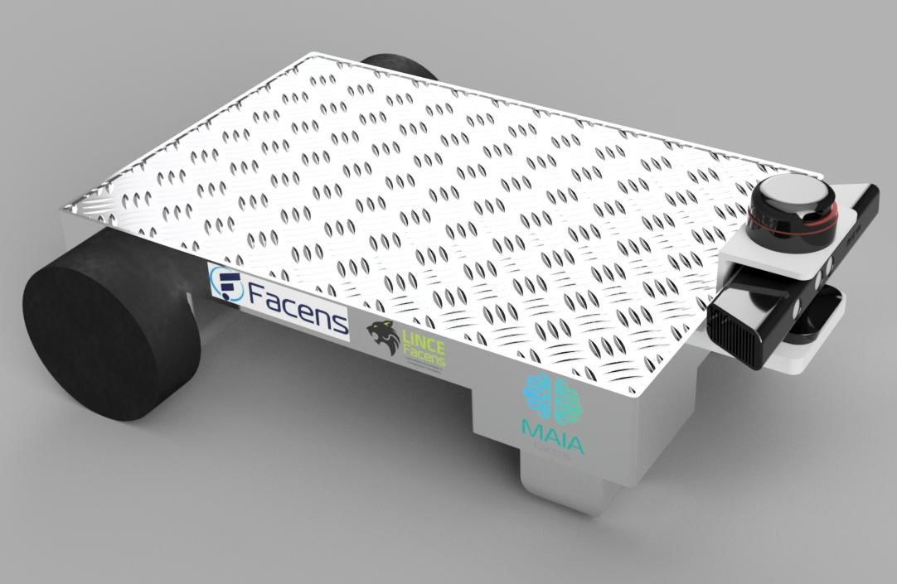

# agv_description

Pacote para simulação projeto AGV. 

- **Criar uma workspace** 
```sh
$ mkdir -p catkin_ws/src
$ cd catkin_ws/src
```
- **Clone do repositório**
```sh
$ git clone https://github.com/luschardt/agv_description.git
```
- **Compilar workspace e utilizar o pacote de execução**
```sh
$ cd ..
$ catkin_make
$ source devel/setup.bash
$ roslaunch agv_description gazebo.launch  
```
- **Para controlar o robo execute o teleop**
```sh
$ sudo apt-get install ros-melodic-teleop-twist-keyboard
$ rosrun teleop_twist_keyboard teleop_twist_keyboard.py 

#Aumentar velocidade - "q"
#Diminuir velocidade - "z"

#Mover para frente   - "i"
#Parar robo          - "k"
#Mover para Trás     - ","
#Mover para Esquerda - "j"
#Mover para Direita  - "l"  
```


